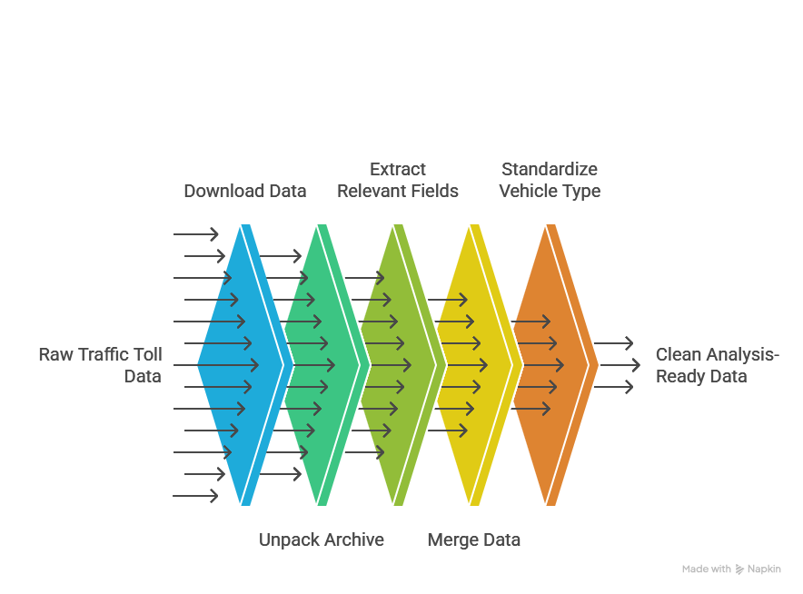

# Tolldata Pipeline

A data engineering pipeline built with Apache Airflow and Python.  
It downloads raw traffic toll data, extracts what matters, and delivers a clean, analysis-ready file — automatically, every day.



---

## What it does

Toll operators collect data from thousands of vehicles every day.  
That data arrives fragmented across three different file formats, produced by three different systems that do not talk to each other.

This pipeline reconciles them.

It runs seven sequential steps without human intervention:

1. Downloads the raw dataset from a remote source
2. Unpacks the archive
3. Reads the vehicle file and keeps the four relevant fields
4. Reads the toll plaza file and keeps the three relevant fields
5. Reads the payment file and keeps the two relevant fields
6. Merges everything into a single, consistent table
7. Standardizes the vehicle type field so downstream tools can group data reliably

The result is one clean file: `transformed_data.csv`.

---

## Why it is built this way

Data pipelines break. Files change format. Servers go down. Steps fail halfway through.

This pipeline is built to handle that.

Each step is isolated. If step four fails, steps one through three are not re-run. Airflow retries the failed step automatically, then continues. Nothing is lost and nothing is duplicated.

Each transformation lives in its own module with its own responsibility. Adding a new data source, a new extraction rule, or a new output format does not require touching the rest of the code.

---

## Project structure

```
airflow-etl-pipeline/
|
|-- dag.py                  The pipeline definition. Tells Airflow what to run and in what order.
|
|-- pipeline/
|   |-- extractor.py        Downloads, unpacks, and extracts fields from each source file.
|   |-- consolidator.py     Merges the three extracted files into one.
|   |-- transformer.py      Cleans and standardizes the merged file.
|
|-- tests/
|   |-- test_pipeline.py    15 automated tests that verify each step works correctly.
|
|-- staging/                Temporary folder where files are written during the pipeline run.
```

---

## What this project demonstrates

**Separation of concerns.**  
Business logic lives in `pipeline/`. Airflow configuration lives in `dag.py`. They do not mix. Changing one does not break the other.

**Encapsulation.**  
Each class exposes only what the rest of the code needs to use. Internal details stay internal.

**Testability.**  
Every transformation can be tested in isolation, without running Airflow, without downloading real data. The test suite runs in under a second.

**Operability.**  
The pipeline runs on a schedule, retries on failure, and produces observable logs for every task. It is designed to run unattended.

---

## How to run it

**Prerequisites:** Python 3.12, Apache Airflow 2.x, the `requests` library.

```bash
# Clone and install
git clone https://github.com/MrPanda225/airflow-etl-pipeline.git
cd airflow-etl-pipeline
pip install -r requirements.txt

# Run the test suite
pytest tests/test_pipeline.py -v

# Symlink the DAG into Airflow's DAG folder
ln -s ~/dev/perso/airflow_train/dag.py ~/airflow/dags/dag.py
ln -s ~/dev/perso/airflow_train/pipeline ~/airflow/dags/pipeline

# Start Airflow
airflow standalone

# Open the UI and trigger the pipeline
# localhost:8080 > Python_DAG > Trigger
```

---

## Data sources

| File | Format | Fields extracted |
|---|---|---|
| `vehicle-data.csv` | Comma-separated | Rowid, Timestamp, Vehicle number, Vehicle type |
| `tollplaza-data.tsv` | Tab-separated | Number of axles, Tollplaza id, Tollplaza code |
| `payment-data.txt` | Fixed-width | Type of Payment code, Vehicle Code |

Output: `staging/transformed_data.csv` — nine fields, one row per vehicle passage, vehicle type in uppercase.

---

Built as part of the IBM Data Engineering Professional Certificate.
